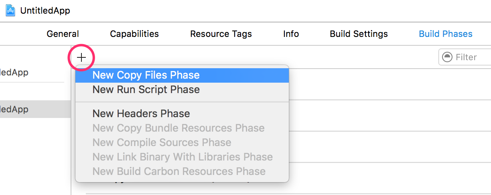

## Frameworks

### iOS and tvOS

1. Download the latest release of Couchbase Lite for iOS from [here](http://www.couchbase.com/nosql-databases/downloads#couchbase-mobile).
2. Unzip the file.
3. Open the Couchbase Lite folder and drag CouchbaseLite.framework to the project navigator in Xcode.
4. In the **Choose options for adding these files** sheet, make sure that your app target is selected.

Couchbase Lite requires additional frameworks and libraries for building an app. These additional dependencies are added via Xcode build settings.

1. In the Xcode navigator, click on the project open the **Build Settings** tab.
2. Scroll to the **Linking** section, find the **Other Linker Flags** row and then add the flag **-ObjC** (be sure to use the capitalization shown).
3. Click the **Build Phases** tab.
4. Expand the **Link Binary With Libraries** section and add the following items.

```
CFNetwork.framework
Security.framework
SystemConfiguration.framework
ibsqlite3.dylib
libz.dylib
```

### OS X

For a Mac OS target, you'll need to make sure the framework is copied to your app's bundle. Follow the steps below.

1. Download the latest release of Couchbase Lite for iOS from [here](http://www.couchbase.com/nosql-databases/downloads#couchbase-mobile).
2. Open the **Build Settings** tab of your app target's settings.
3. In the **Linking** section, edit **Runpath Search Paths** and add `@loader_path/../Framewors/`.
4. Now switch to the **Build Phases**.
5. Press the **Add Build Phase** button at the top of the window and create a new **Copy Files** phase.
    
6. Set the phase's destination to **Frameworks**.
7. Press the **+** button below the phases' file list and select CouchbaseLite.framework to add it.


## Cocoapods

1. [Install Cocoapods](https://guides.cocoapods.org/using/getting-started.html)
2. In your `Podfile`, add `pod 'couchbase-lite-ios'`.
3. From the command line, run `pod install`.
4. Use the `.xcworkspace` file generated by CocoaPods to work on your project!

## Carthage

1. [Install Carthage](https://github.com/Carthage/Carthage#installing-carthage)
2. Add github "couchbase/couchbase-lite-ios" to your Cartfile.
3. Run `carthage update`.
4. Drag `CouchbaseLite.framework` from the appropriate platform directory in `Carthage/Build/` to the "Embedded Binaries" section of your Xcode project's "General" settings.

## Optional packages

The SDK contains other dependencies that are optional.

Here's what each one does:

- **CouchbaseLiteListener.framework**: To access the database through HTTP (often used for hybrid development and peer-to-peer sync).
- **CBLJSONValidator**: Validates JSON objects against JSON-Schema specs.
- **CBLRegisterJSViewCompiler** + **libCBLJSViewCompiler.a**: To register Views and Filters through the Listener. When doing so, the logic is written in JavaScript and stored in the database.
- **libCBLForestDBStorage.a**: To use the ForestDB storage type.
- **libsqlcipher.a**: To enable encryption on SQLite databases.
- **Extras/CBLEncryptionController**: Utility class to handle password entry. Prompts the user to make up a key, asks for the key when re-opening the database, and asks again if the key was incorrect. It even takes advantage of Touch ID fingerprint authentication on recent iOS devices to avoid making the user deal with a password at all.
- **Extras/CBLIncrementalStore**: A subclass of the NSIncrementalStore to allow Core Data to use a Couchbase Lite database as its persistent storage instead of the default SQLite database.
- **Extras/CBLUICollectionSource**: A UICollectionView data source driven by a CBLLiveQuery.