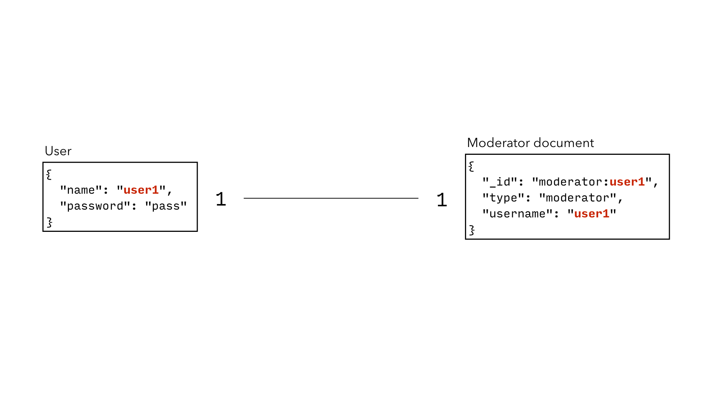
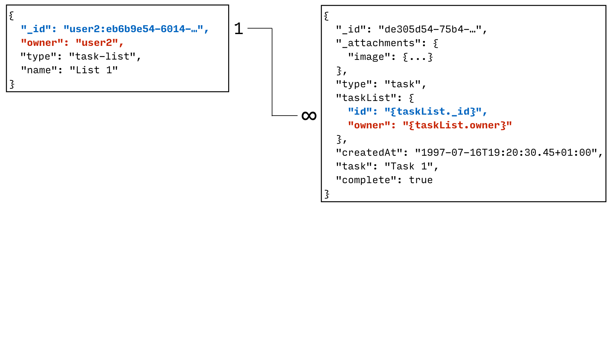
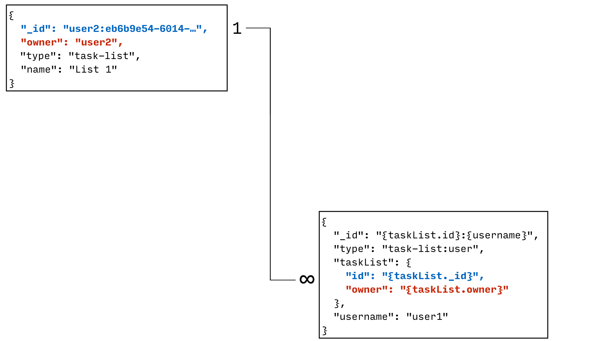

In this lesson you will learn how to model the data for an application and the relationships between the different models.

Couchbase Mobile stores data in documents rather than in table rows. A document is a JSON object containing a number of key-value pairs. This means that it can take any form as long as it is valid JSON. As shown below, the values can be any of the following types: string, array, integer, dictionary or boolean.

This concept is sometimes referred to as the schemaless nature of the data, the database doesn't enforce any particular constraint on how the data should be structured. Instead, it's the application's responsibility to ensure that documents meet the data contract. The application presented in this training has 4 different types of documents:

- `task-list`: A document that represents a list.
- `moderator`: A document that grants the moderator role to a particular user.
- `task`: A document that represents a task.
- `task-list:user`: A document that represents a user in a list.

## One-to-one relationship

In this application there is a 1:1 relationship between a User and the Moderator document. A user can only have one document of type **moderator** and, vice versa, a moderator document belongs to a single user.

## One-to-many relationship

It doesn't get much different for one-to-many relationships. In this application, a list can hold multiple tasks but a task belongs to only one list. Therefore there is a 1:many relationship between list and task documents. The task document holds a reference to the list it belongs to.

Similarly, a list document can be shared with multiple users represented by a document of type **task-list:user** but a list user belongs to a single list. Hence, there is a 1:many relationship between list and list user documents. The list user holds a reference to the list it has access to.

## Conclusion

Well done! You've completed this lesson on modeling the data in different documents and the relationships between them. In the next lesson you'll learn how to design the security model for each type of document. Feel free to share your feedback, findings or ask any questions on the forums.