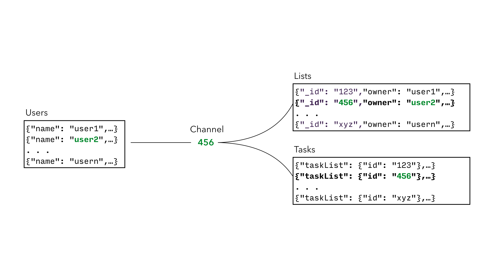
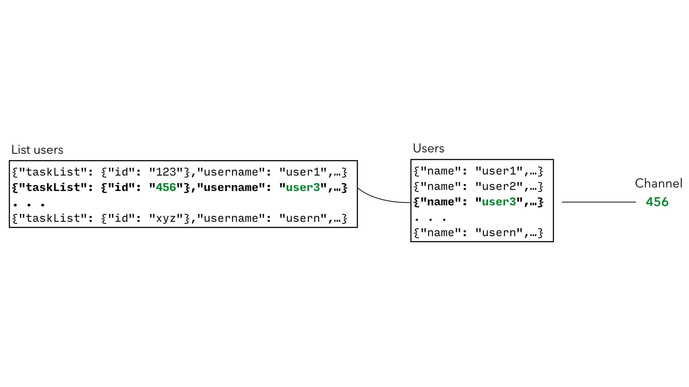
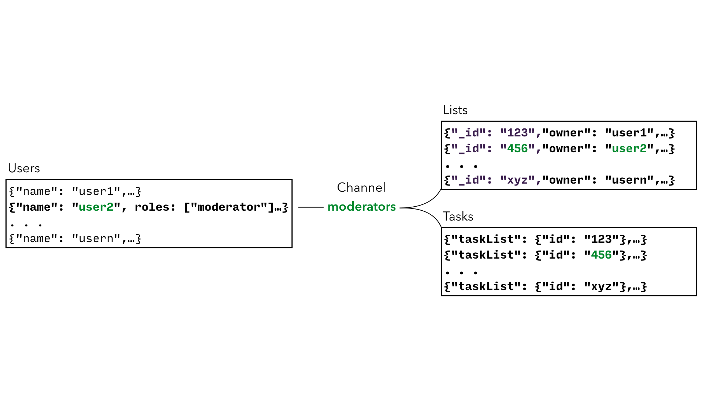
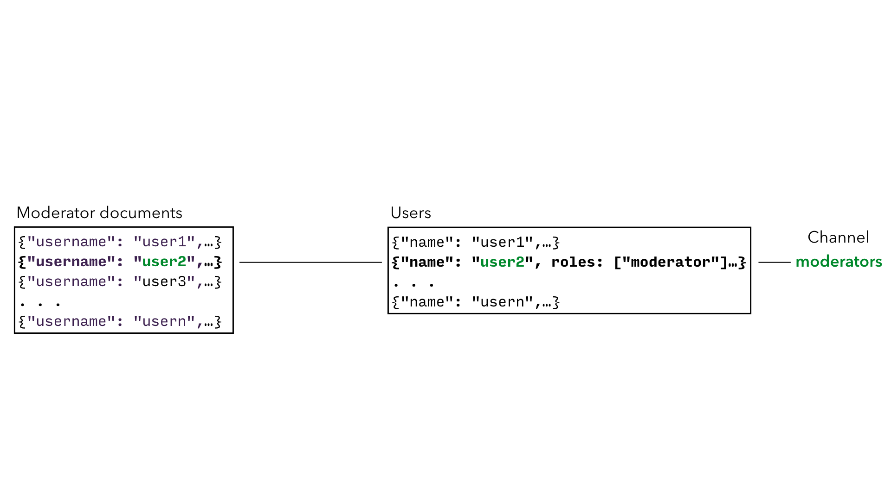

In this lesson you’ll learn how to secure your data model using Couchbase Mobile’s built-in security framework. You’ll design the security rules for each object in your data model. This includes access control, data validation, and access grants.

To start designing your security model you must first have a basic understanding of the security features in Sync Gateway. The Sync Function is the core API you interact with on Sync Gateway. Every time a new document is added the Sync Function is called and given a change to examine the document. It can do the following things:

- Validate the document.
- Authorize the change if it's an update operation.
- Assign the document to channels (i.e routing).
- Grant users access to channels (i.e read permission).

## List ownership

The list and tasks are routed to the same channel (456) and the owner of that list has access to that channel. The channel name corresponds to the list _id.

## List sharing

A list user document is created to grant a **username** access to a list.

## Moderator role

Users with the **moderator** role can access any list.

## Admin role

Users with the **admin** role can give the **moderator** role to any user.

## Conclusion

Well done! You've completed this lesson on designing the security model for each scenario in the application. In the next lesson you'll learn how to create an empty database to store documents. Feel free to share your feedback, findings or ask any questions on the forums.