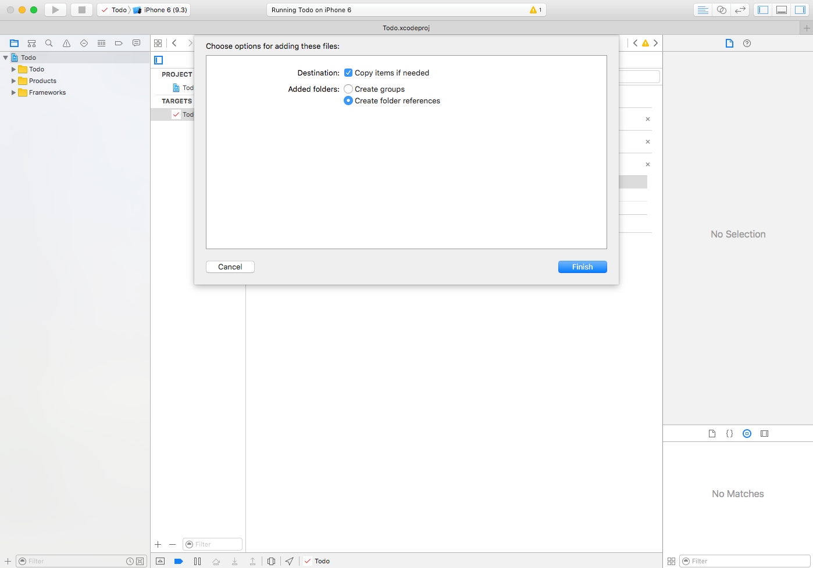

In this lesson you’ll be introduced to Couchbase Lite, our embedded NoSQL database. You’ll learn how to create a new embedded database and optionally use databases pre-packaged in your application.

[//]: # "COMMON ACROSS LESSONS"

Start this lesson by downloading the starter project below.

<block class="ios" />

<div class="buttons-unit downloads">
  <a href="https://cl.ly/0v0g1B0O1O0Z/part1_start.zip" class="button" id="starter-project">
    Download the Xcode project
  </a>
</div>

## Installation

[Download Couchbase Lite for iOS](http://www.couchbase.com/nosql-databases/downloads#couchbase-mobile). Unzip the file and drag **CouchbaseLite.framework** to the **Frameworks** folder in Finder. It's important to do this in Finder as opposed to Xcode.


<block class="rn" />

This is the **download** button for the react native plugin

[//]: # "COMMON ACROSS LESSONS"

<block class="rn ios" />

## Create a new database

In this task, you'll learn how to create a new database. Here's how it's done:

```swift
// This code can be found in the sample project in:
// AppDelegate.swift line 80

// Create a database with the specified name and options.
try database = CBLManager.sharedInstance().openDatabaseNamed(dbname, withOptions: options)
```

The entrypoint in the Couchbase Lite SDK is the **Manager** class. You can think of a database as a namespace for documents. There is no limit to how many databases can be created or opened on the device (one database per user of the app is a common pattern). A database is stored in the application directory and is only accessible from this application. The `openDatabaseNamed` method is used to create a new database.

### Try it out

1. Build and run the sample project.
2. Create a new list using the 'Add' button on the application's 'Task lists' screen.

    

3. The code is located in the `openDatabase(username:withKey:withNewKey)` method in **AppDelegate.swift**. By default, database encryption is disabled (i.e. `kEncryptionEnabled` is false) so you don't have to worry about it for now. Database encryption is covered in the **Security** lesson.

<block class="ios rn" />

In the next section, you will learn how to bundle a pre-built database.

## Using the pre-built database

In most cases, apps start with an empty Couchbase Lite database where data is added by the user as you have done above or through synchronization with Sync Gateway.

However, you can also bundle a pre-built database in your application if your app needs to sync a lot of static data initially. It can be a lot more efficient to bundle a database in your application and install it on the first launch. Even if some of the content changes on the server after you create the app, the app's first pull replication will bring the database up to date.

In this task, you’ll learn how to use a database pre-populated with data bundled with your application. The pre-built database contains a list of groceries. Download it from the link below and follow the instructions.

```swift
let dbPath = NSBundle.mainBundle().pathForResource("todo", ofType: "cblite2")
do {
    try CBLManager.sharedInstance().replaceDatabaseNamed("todo", withDatabaseDir: dbPath!)
} catch let error as NSError {
    NSLog("Cannot replace the database %@", error)
}
```

### Try it out

<block class="ios" />

- [Download the pre-built database](https://cl.ly/453l3M1O151a/prebuilt-db.zip)
- Unzip the file.
- Drag **todo.cblite2** to the Copy Bundle Resources on the Build Phases tab in Xcode.


Be sure to check the **Copy items if needed** and **Create folder references** options from the dropdown panel.



- Enable the pre-built database in the sample project. In **AppDelegate.swift**, set the `kUsePrebuiltDatabase` to `true`.

```swift
let kUsePrebuiltDatabase = true
```

Build and run. The Today list you added previously is replaced with the Groceries list.

<block class="rn" />

<block class="ios rn" />

## Need help?

We offer free [forum support](https://forums.couchbase.com/c/mobile) to every developer, and our Couchbase Mobile team and expert developer advocates are active on Stack Overflow and GitHub.

We're here to help.