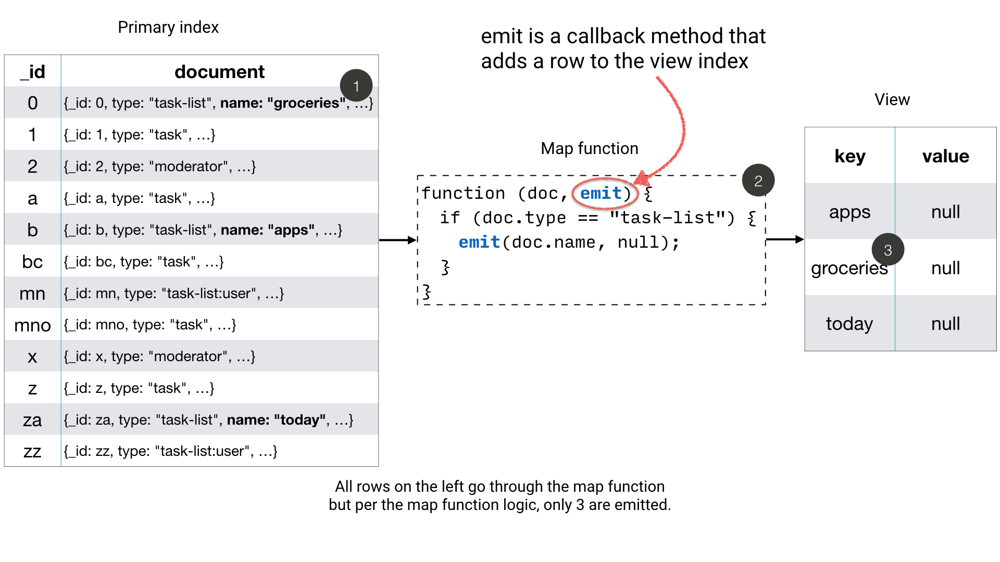
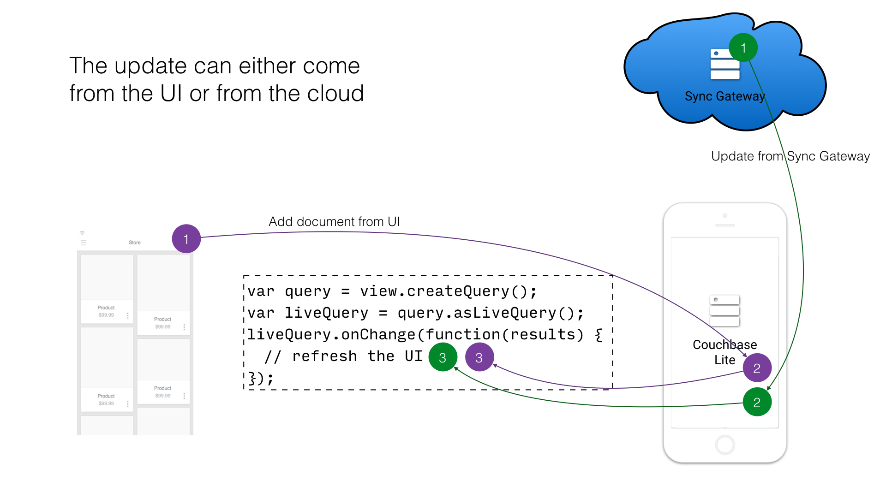
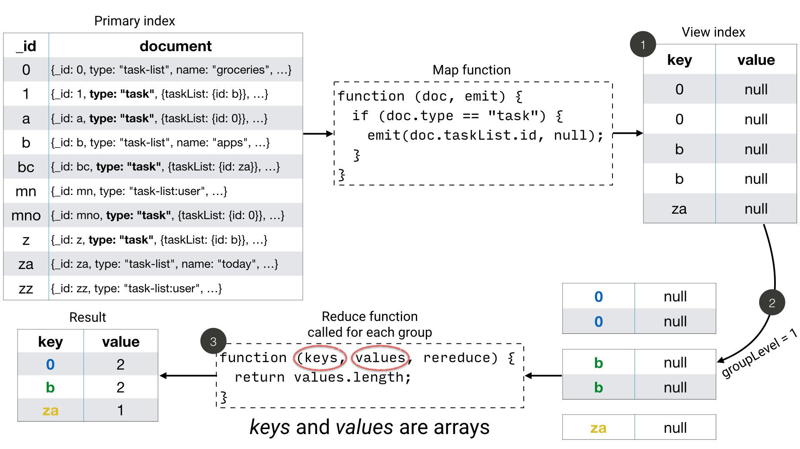

In this lesson you’ll be introduced to Couchbase Lite, our embedded NoSQL database. You’ll learn how to create, read, update, delete, and query data using Couchbase Lite.

[//]: # "COMMON ACROSS LESSONS"

#### Requirements

- Xcode 8 (Swift 3)

#### Getting Started

Download the project below.

<block class="ios" />

<div class="buttons-unit downloads">
  <a href="https://cl.ly/2A2D3q3R2d1g/xcode-project.zip" class="button" id="project">
    
  </a>
</div>

Unzip the file and install the dependencies using Cocoapods.

```bash
$ cd xcode-project
$ pod install
```

Open **Todo.xcodeproj** in Xcode. Then build & run the project.


Throughout this lesson, you will navigate in different files of the Xcode project. We recommend to use the method navigator to scroll to a method.


[//]: # "COMMON ACROSS LESSONS"

<block class="ios rn" />

> **Tip:** To make things a bit more exciting, you may want to use the pre-built database containing a list of Groceries. Refer to the [Create a Database](/documentation/mobile/current/develop/training/using-the-database/index.html) lesson to learn how to use it.

## Create a Document

In Couchbase Lite, the primary entity stored in a database is called a document instead of a "row" or "record". A document's body takes the form of a JSON object — a collection of key/value pairs where the values can be different types of data such as numbers, strings, arrays or even nested objects. The code below creates a new list document.

<block class="ios" />

```swift
// This code can be found in ListsViewController.swift
// in the createTaskList(name:) method
let properties: [String : Any] = [
    "type": "task-list",
    "name": name,
    "owner": username
]

let docId = username + "." + NSUUID().uuidString
guard let doc = database.document(withID: docId) else {
    Ui.showMessageDialog(onController: self, withTitle: "Error",
        withMessage: "Couldn't save task list")
    return nil
}

do {
    return try doc.putProperties(properties)
} catch let error as NSError {
    Ui.showMessageDialog(onController: self, withTitle: "Error",
        withMessage: "Couldn't save task list", withError: error)
    return nil
}
```

<block class="ios rn" />

Here you're creating an unsaved document instance with a pre-defined **document ID** (i.e. the **_id** property in the document’s JSON body) using the `documentWithID` method. The ID follows the form `{username}.{uuid}` where username is the name of the user logged in. Alternatively, you could also use the `createDocument` method to let the database generate a random **ID** for you.

### Try it out

<block class="ios" />

1. Build and run.
2. Create a new list using the '+' button on the application's 'Task lists' screen.
3. A new list document is saved to the database.
    

<block class="ios rn" />

## Update a Document

To update a document, you must retrieve it from the database, modify the desired properties and write them back to the database. The `update` method does this operation for you in the form of a callback. The code below updates a list's name property.

<block class="ios" />

```swift
// This code can be found in ListsViewController.swift
// in the updateTaskList(list:withName:) method
do {
    try list.update { newRev in
        newRev["name"] = name
        return true
    }
} catch let error as NSError {
    Ui.showMessageDialog(onController: self, withTitle: "Error",
        withMessage: "Couldn't update task list", withError: error)
}
```

<block class="ios rn" />

Your callback code can modify this object's properties as it sees fit; after it returns, the modified revision is saved and becomes the current one.

### Try it out

<block class="ios" />

1. Build and run.
2. Swipe to the left on a row to reveal the **Edit** button and update the List name in the pop-up.
    

<block class="ios rn" />

## Delete a Document

A document can be deleted using the `delete` method. This operation actually creates a new revision in order to propagate the deletion to other clients. The code below deletes a list.

<block class="ios" />

```swift
// This code can be found in ListsViewController.swift
// in the deleteTaskList(list:) method
do {
    try list.delete()
} catch let error as NSError {
    Ui.showMessageDialog(onController: self, withTitle: "Error",
        withMessage: "Couldn't delete task list", withError: error)
}
```

### Try it out

<block class="ios" />

1. Build and run.
2. Click the **Delete** action to delete a list.
    

<block class="ios rn"/>

## Query Documents

The way to query data in Couchbase Lite is by registering a View and then running a Query on it with QueryOptions. The first thing to know about Couchbase Views is that they have nothing to do with UI views.

A [View](/documentation/mobile/current/develop/guides/couchbase-lite/native-api/view/index.html) in Couchbase is a persistent index of documents in a database, which you then query to find data. The main component of a View is its map function. It takes a document’s JSON as input, and emits (outputs) any number of key/value pairs to be indexed. First, you will define the view to index the documents of type **task-list**. The diagram below shows the result of the code you will review shortly.



So you can remember that a view index is a list of key/value pairs, sorted by key. In addition, the view’s logic is written in the native language of the platform you’re developing on. The code below indexes documents as shown on the diagram above. Then it create the Query and monitors the result set using a Live Query.

<block class="ios" />

```swift
// This code can be found in ListsViewController.swift
// in the setupViewAndQuery method
let listsView = database.viewNamed("list/listsByName")
if listsView.mapBlock == nil {
    listsView.setMapBlock({ (doc, emit) in
        if let type: String = doc["type"] as? String, let name = doc["name"]
            , type == "task-list" {
                emit(name, nil)
        }
    }, version: "1.0")
}

listsLiveQuery = listsView.createQuery().asLive()
listsLiveQuery.addObserver(self, forKeyPath: "rows", options: .new, context: nil)
listsLiveQuery.start()
```

The `viewNamed` method returns a [View](http://developer.couchbase.com/documentation/mobile/current/develop/guides/couchbase-lite/native-api/view/index.html) object on which the map function can be set. The map function is indexing documents where the type property is equal to "task-list". Each cell on the screen will contain a list name and nothing else. For that reason, you can emit the name property as the key and nil is the value. If you also wanted to display the owner of the list in the row you could emit the `owner` property as the value.

The `listsView.createQuery()` method returns a [Query](/documentation/mobile/current/develop/guides/couchbase-lite/native-api/query/index.html) object which has a **run** method to return the results as a [QueryEnumerator](/documentation/mobile/current/develop/references/couchbase-lite/couchbase-lite/query/query-enumerator/index.html) object. However, in this case, you are hooking into a [Live Query](/documentation/mobile/current/develop/guides/couchbase-lite/native-api/query/index.html) to keep monitoring the database for new results. Any time the result of that query changes through user interaction or synchronization, it will notify your application via the change event. A live query provides an easy way to build reactive UIs, which will be especially useful when you enable sync in the [Adding Synchronization](/documentation/mobile/current/develop/training/adding-synchronization/index.html) lesson. The change event is triggered as a result of user interaction locally as well as during synchronization with Sync Gateway.



<block class="ios" />

In the code blow, the notifications are posted to the application code using the KVO observer method.

```swift
// This code can be found in ListsViewController.swift
// in the observeValue(forKeyPath:of:_:_:) method
override func observeValue(forKeyPath keyPath: String?, of object: Any?, change: [NSKeyValueChangeKey : Any]?, context: UnsafeMutableRawPointer?) {
    if object as? NSObject == listsLiveQuery {
        reloadTaskLists()
    } else if object as? NSObject == incompTasksCountsLiveQuery {
        reloadIncompleteTasksCounts()
    }
}
```

<block class="ios rn" />

### Try it out

1. Build and run.
2. Save a new list to the database and the live query will pick it up instantly and reload the table view.
    

<block class="ios rn" />

## Aggregating Data

A problem in typical applications is how to perform data aggregation. Couchbase Lite lets you run those data queries using the full capabilities of map/reduce. To run aggregation queries on the rows emitted by the map function, you can use the reduce function which is the part of map/reduce that takes several rows from the index and aggregates them together in a single object.

Let’s write a view to query and display the number of uncompleted tasks for each list. A task is marked as completed if its **complete** property is true. You need to define a **map** function which returns the number of uncompleted task documents, **group** them by the list they belong to and **count** the number of rows in each group.



Notice that **groupingLevel = 1** coalesces the rows in the view index by their key.

[Grouping](/documentation/mobile/current/develop/guides/couchbase-lite/native-api/query/index.html) is a powerful feature of Couchbase Lite. It is available on a **Query** using the **groupLevel** property, which is a number, and it defaults to 0. It basically takes the entire range of output that the query produces (i.e. the entire range of rows) and it coalesces together adjacent rows with the same key.

The most commonly used reduce functions are Count and Sum:

- Count: A function that counts the number of documents contained in the map (used on the diagram above).
- Sum: A function that adds all of the items contained in the map.

The code below indexes documents as shown on the diagram above. Then it create the Query and monitors the result set using a Live Query.

<block class="ios" />

```swift
// This code can be found in ListsViewController.swift
// in the setupViewAndQuery() method
let incompTasksCountView = database.viewNamed("list/incompleteTasksCount")
if incompTasksCountView.mapBlock == nil {
    incompTasksCountView.setMapBlock({ (doc, emit) in
        if let type: String = doc["type"] as? String , type == "task" {
            if let list = doc["taskList"] as? [String: AnyObject], let listId = list["id"],
                let complete = doc["complete"] as? Bool , !complete {
                emit(listId, nil)
            }
        }
        }, reduce: { (keys, values, reredeuce) in
        return values.count
    }, version: "1.0")
}

incompTasksCountsLiveQuery = incompTasksCountView.createQuery().asLive()
incompTasksCountsLiveQuery.groupLevel = 1
incompTasksCountsLiveQuery.addObserver(self, forKeyPath: "rows", options: .new, context: nil)
incompTasksCountsLiveQuery.start()
```

This time, you call emit only if the document `type` is "task" and `complete` is `false`. The document ID of the list it belongs to (**doc.taskList._id**) serves as the key and the value is nil. The reduce function simply counts the number of rows with the same key. Notice that the **groupLevel** is a property on the live query object.

Every time there is a change to `incompTasksCountsLiveQuery.rows` the `observeValueForKeyPath` method is called which will reload the list count for each row.

```swift
// This code can be found in ListsViewController.swift
// in the observeValue(forKeyPath:of:_:_:) method
override func observeValue(forKeyPath keyPath: String?, of object: Any?, change: [NSKeyValueChangeKey : Any]?, context: UnsafeMutableRawPointer?) {
    if object as? NSObject == listsLiveQuery {
        reloadTaskLists()
    } else if object as? NSObject == incompTasksCountsLiveQuery {
        reloadIncompleteTasksCounts()
    }
}
```

<block class="ios rn" />

### Try it out

<block class="ios" />

1. Build and run.
2. You will see the uncompleted task count for each list.
    

<block class="ios rn" />

## Conclusion

Well done! You've completed this lesson on using CRUD operations with the database and running aggregation queries. In the next lesson, you'll learn how to use Couchbase Lite's synchronization APIs with Sync Gateway. Feel free to share your feedback, findings or ask any questions on the forums.