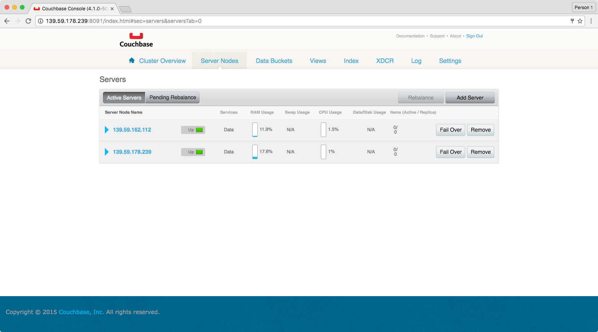

In this lesson you'll learn how to scale Sync Gateway and Couchbase Server in real-time with zero downtime.

#### Requirements

Two instances with the following:

- Ubuntu >= 12.04, =< 14.04
- RAM >= 2GB

## Architecture

## Scaling Sync Gateway

### Try it out

1. Deploy 2 nodes of Sync Gateway on different instances.

## Using a reverse proxy

When using more than 1 node of Sync Gateway it is recommended to use a proxy server to distribute the load accross the different Sync Gateway instances. In this lesson you will use Nginx before adding another node of Sync Gateway.

### Try it out

1. Install Nginx.

    ```bash
    sudo apt-get install nginx
    ```

2. Insert the following in a new file **/etc/nginx/sites-available/sync_gateway**.

    ```bash
    upstream sync_gateway {
        server 139.59.178.239:4984;
        server 139.59.162.112:4984;
    }
    # HTTP server
    #
    server {
        listen 80;
        client_max_body_size 20m;
        location / {
            proxy_pass              http://sync_gateway;
            proxy_pass_header       Accept;
            proxy_pass_header       Server;
            proxy_http_version      1.1;
            keepalive_requests      1000;
            keepalive_timeout       360s;
            proxy_read_timeout      360s;
        }
    }
    ```

3. Enable this configuration by creating a symlink to a file with the same name in the folder **/etc/nginx/sites-enabled**.

    ```bash
    ln -s /etc/nginx/sites-available/sync_gateway /etc/nginx/sites-enabled/sync_gateway
    ```

4. Restart nginx.

    ```bash
    sudo service nginx restart
    ```

> **Note:** You can now run the Todo mobile app with the URL pointing to your nginx server publicly accessible.

## Scaling Couchbase Server

### Try it out

1. Download Couchbase Server 4.1 using `wget`.

    ```bash
    wget http://packages.couchbase.com/releases/4.1.0/couchbase-server-community_4.1.0-ubuntu14.04_amd64.deb
    ```

2. Install Couchbase Server 4.1 using `dpkg`.

    ```bash
    dpkg -i couchbase-server-community_4.1.0-ubuntu14.04_amd64.deb
    ```

3. Add this Couchbase Server instance to the existing cluster.

    ```bash
    /opt/couchbase/bin/couchbase-cli server-add --cluster localhost:8091 --server-add=139.59.178.239:8091 --server-add-username=Administrator --server-add-password=password -u Administrator -p password
    ```

4. Start the rebalance.

    ```bash
    /opt/couchbase/bin/couchbase-cli rebalance -c localhost:8091 --server-add-username=Administrator --server-add-password=password -u Administrator -p password
    ```

5. The Couchbase Server Admin Console now contains 2 nodes.

    

## Conclusion

Well done! You've completed this lesson on scaling. Feel free to share your feedback, findings or ask any questions on the forums.