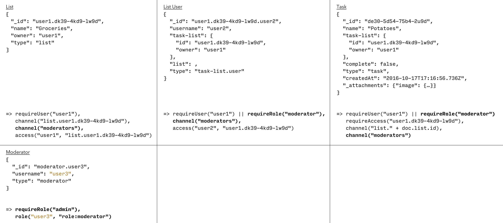

In this lesson you’ll learn how to secure your data model using Couchbase Mobile’s built-in security framework.

Security rules are used to determine who has read and write access to the database. They live on the server in Sync Gateway and are enforced at all times.

The access control requirements for the application are the following.

1. A user can create a list and tasks.
2. The owner of a list can invite other users to access the list.
3. Users invited to a list can create tasks.
4. A moderator has access to all lists.
5. A moderator can create new tasks and invte users.

## Routing

Sync Gateway provides an ability to assign documents to something we call channels. You control assigning documents to channels through the Sync Function. The image below specifies that the List and Task documents are assigned to the same channel ("list.user1.dk39-4kd9-lw9d").

## Read Access

### Single user

Once the document is mapped to the channel you can give the user access to it. In doing so, that user will have read access to all the documents in the channel. The following image specifies the `access` call to grant read access to the list channel.

> **Tip:** As shown above, you can route documents of different types to the same channel. The `access` method can then be invoked once since the list and its tasks are in the same channel.

### Multiple users

Now let's consider the action of sharing a list with another user. Currently, List and Task models do not have an option to specify other user names.

In the application, there is no limit to how many users can access a list. There could be thousands! So instead of embedding other user's details on the List model we'll introduce a 3rd document that joins a list and user. The image below adds the List User model. When processing a document of type "list-user", the Sync Function must grant the user (`doc.name`) access to the list (`doc.list`).

## Write Access

Write access security rules are necessary to protect the system. Generally that means checking that the user is allowed to perform the operation before persisting the document to disc.

### By user

The image below adds a rule to ensure that only the List owner can persist those documents.

The List model is the straightforward case, it checks that the user synchronizing the document is indeed the owner of the list (`doc.owner`).

For List User and Task documents the same security can be enforced because the owner is prefixed on the List document ID ("user1.dk39-4kd9-lw9d").

### By Access

The image below adds a rule to allow invited users to create tasks. If the user sending the task has access to the list channel ("user1.dk39-4kd9-lw9d") then it must have been invited and therefore can persist the task.

## Roles

Another design requirement of the application is that certain users can be moderators. In that case they can perform more operations than other non-moderating users. A user can be elected to be a moderator by users with the admin role only.

The image below adds a new Moderator model for this purpose.

The following security changes to routing, read and write permissions were added.

- List, List User and Task documents are routed to the "moderators" channel.
- Moderators have access to all the lists and can create new tasks or invite users.

## Conclusion

Well done! You've completed this lesson on designing the security model for each scenario in the application. In the next lesson you'll learn how to create an empty database to store documents. Feel free to share your feedback, findings or ask any questions on the forums.